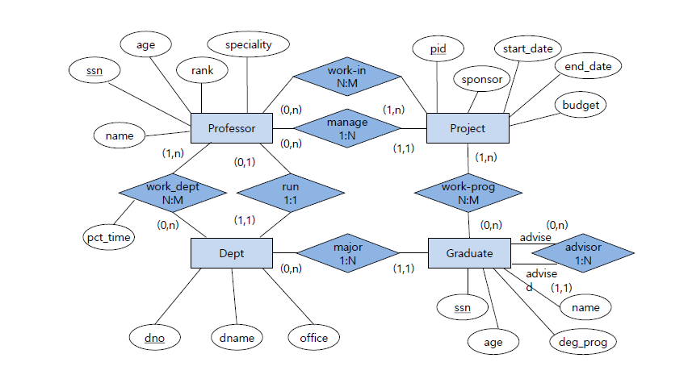
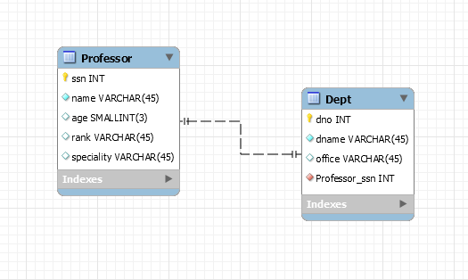

#### 추가 slave 만들기(node2, node3)

* sql 설치과정 똑같이 진행 (11번 생략됨)

### 데이터 모델링

* 데이터베이스 생명주기

==>요구사항 수집 및 분석 > 설계 > 구현 > 운영 > 감시 및 개선 > 요구사항…

* 설계세부단계
  * 개념적 모델링(=스키마) - 중요개념을 구분 : 핵심 Entity(독립개체) 도출, ERD 작성
  * 논리적 모델링 - 각 개념을 구체화 : ERD-RDB 모델 사상, 상체속성정의, 정규화등
  * 물리적 모델링 - 데이터베이스 생성 계획에 따라 개체, 인덱스 등을 생성 : DB 개체 정의, 테이블 및 인덱스 등 설계

* ER모델 - 개체와 개체 간의 관계를 표현
  * 개체(네모) : 독립적인 의미를 지니고 있는 유무형의 사람 또는 사물개체의 특성을 나타내는 속성에 의해 식별됨. 개체끼리 서로 관계를 가짐
  * 속성 : 개체가 가진 성질(타원)
  * 관계 : 개체 사이의 연관성을 나타내는 개념(마름모)
* 관계타입의 유형-차수에 따른 유형(차수 : 개체 타입의 수)
  * 1진관계 : 한 개의 개체가 자기 자신과 관계를 맺음
  * 2진관계 : 두 개의 개체가 관계를 맺음
  * 3진관계 : 세 개의 개체가 관계를 맺음
* 관계 대응수 : 두 개체 타입의 관계에 실제로 참여하는 개별 개체 수
  * 일대일
  * 일대다
  * 다대일
  * 다대다 ( * 관계형 데이터베이스에서는 일대다로 쪼개서 써야함)
* IE표기법
  * 식별자 : 기본키 / 나머지속성 : 일반
* ERwin : 데이터 모델링을 하기 위한 프로그램.IE 표기법을 지원함
* 예제

```bash
1.교수(Professor)는아이디(ssn), 이름(name), 나이(age), 직위(rank), 연구분야(speciality)를가진다.
2.학과(Department)에는학과번호(dno), 학과이름(dname), 학과사무실(office)이있다.
3.대학원생(Graduate)은아이디(ssn), 이름(name), 나이(age), 학위과정(deg_prog, 석사/박사)을가진다.
4.과제(Project)는과제번호(pid), 지원기관(sponsor), 개시일(start_date), 종료일(end_date), 예산액(budget)이있다.
5.학과마다그학과를운영(run)하는교수(학과장이라고한다)가한명씩있다.
6.한교수가여러학과에서근무(work-dept)할수있는데, 이때각학과별로참여백분율(pct_time)이기록된다.
7.대학원생에게는학위과정을밟을전공학과(major)가하나씩있다.
8.대학원생에게는어떤과목을들으면좋을지조언(advisor)해주는선임대학원생(학생조언자라고한다)이있다.
9.과제는한교수(연구책임자라고한다)에의해관리(manage)된다.
10.과제는한사람이상의교수(공동연구책임자라고한다)에의해수행(work-in)된다.
11.한과제는한명이상의대학원생(연구조교라고한다)에의해수행(work-prog)된다.

Professor(ssn, name, age, rank, speciality)
Dept(dno, dname, office, run_professor_ssn)
Graduate(ssn, name, age, deg_prog, dept_dno, advisor_ssn)
Project(pid, sponsor, start_date, end_date, budget, manage_ssn)

M:N 관계는 교차 테이블로 생성
Work-dept(professor_ssn, dept_dno, pct_time)
Work-in(professor_ssn, pid)
Work-prog(graduate_ssn, pid)
```

* 개념적모델링





